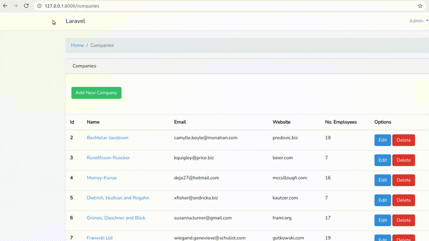

# Where On Website

A crawler that searches for text on internal web pages of a website.



## Usage

```php
set_time_limit(0);

require_once '/vendor/autoload.php';

$wow = WhereOnWebsite\Factory\WOWFactory::create();

$textToSearch = 'discount';
$url = 'https://example.com/category/travel/page/1';
$limit = 28; // max number of internal web pages to attempt to scan 

$output = $wow->searchText($textToSearch, $url, $limit);

echo '<pre>';
echo 'Matched:<br>';
var_dump($output->getMatched());
echo '<br>';
echo 'Attempted to scan:<br>';
var_dump($output->getScanned());
echo '</pre>';
```